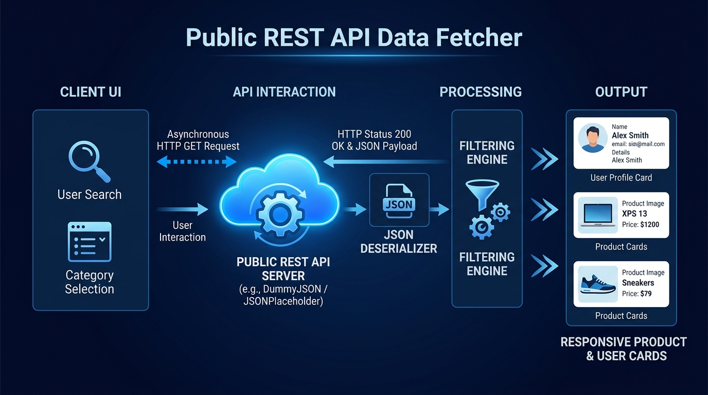

# 🌐 Task 2: Public REST API Data Fetcher & Explorer

**Saiket Internship Assignment - Task 2**

A comprehensive multi-interface application that fetches, parses, filters, searches, and displays data from **Public REST APIs** with robust network error handling and asynchronous threading.

---

## 🎯 Features Implemented



1. **Multiple Public REST Endpoints**:
   - 📦 **Products Catalog API**: `https://dummyjson.com/products`
   - 👥 **User Directory API**: `https://jsonplaceholder.typicode.com/users`
2. **Asynchronous & Non-Blocking**:
   - In Python Tkinter GUI, API calls run on background worker threads (`threading.Thread`) so the UI never freezes or stutters.
   - In the Web UI, standard ES6 `async / await` and `fetch()` API are used.
3. **Live Search & Filter**:
   - Filter items instantly by Name, Category, Price, or Email.
4. **Error & Status Code Handling**:
   - Gracefully manages HTTP 200 OK, 404 Not Found, 500 Server Errors, timeouts, and offline network state.
5. **Detailed JSON Inspector**:
   - View raw JSON payloads and nested attributes for any item.

---

## 🚀 How to Run

### Option 1: Desktop GUI App (Recommended ⭐)
```powershell
python Task2_API_Data_Fetcher/gui_fetcher.py
```

### Option 2: Modern Web Dashboard
Double click or open [`Task2_API_Data_Fetcher/index.html`](index.html) in your browser.

### Option 3: Command-Line Interface (CLI)
```powershell
python Task2_API_Data_Fetcher/api_fetcher.py
```
