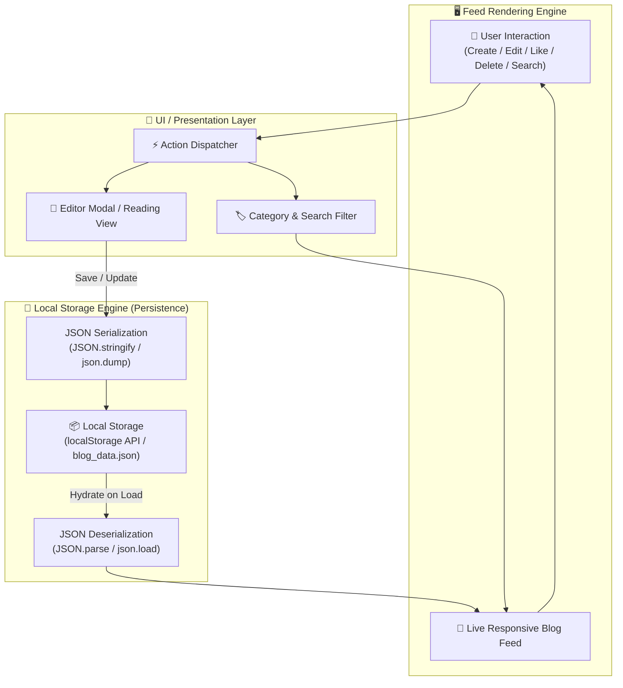

# 📝 Task 3: Simple Blog App + Local Storage

**Saiket Internship Assignment - Task 3**

A modern, responsive **Blog Management System** with full **CRUD (Create, Read, Update, Delete)** operations, search, category filtering, likes, and local data persistence via **Browser `localStorage`** (Web) and **JSON File Storage** (Python Desktop).

---

## 🎯 Features Implemented

1. **Full CRUD Lifecycle**:
   - ✍️ **Create**: Write new posts with Title, Author, Category, and Content.
   - 📖 **Read**: Rich reading modal / inspection mode.
   - ✏️ **Update**: Edit existing articles with instantaneous local sync.
   - 🗑️ **Delete**: Remove articles with confirmation prompts.
2. **Local Storage Engine**:
   - **Web**: Uses `window.localStorage` with auto-seed initial data, JSON Export & Import backups.
   - **Desktop**: Persistent `blog_data.json` local storage file.
3. **Interactive Features**:
   - ❤️ Real-time Like/Clap counter per post.
   - 🔍 Live search by title, content, or author.
   - 🏷️ Category filter pills (Technology, Web Dev, Career, General).

---

## 🔄 Architecture & Data Flow



---

## 🚀 How to Run

### Option 1: Modern Web Dashboard (Recommended ⭐)
Double click or open [`Task3_Blog_App/index.html`](index.html) in your browser.

### Option 2: Desktop GUI App
```powershell
python Task3_Blog_App/gui_blog_app.py
```

### Option 3: CLI Console App
```powershell
python Task3_Blog_App/blog_app.py
```
